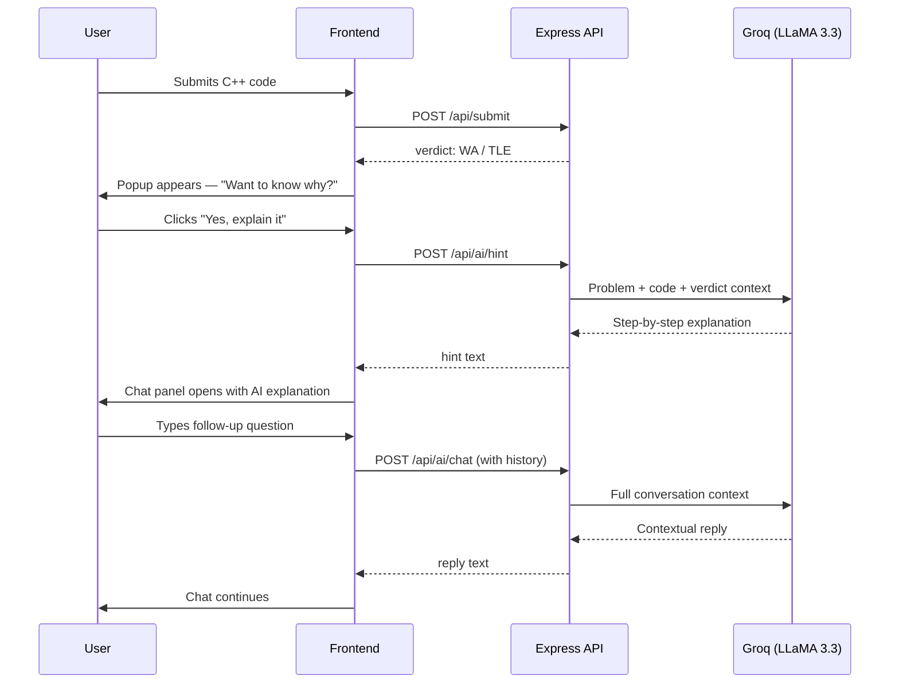
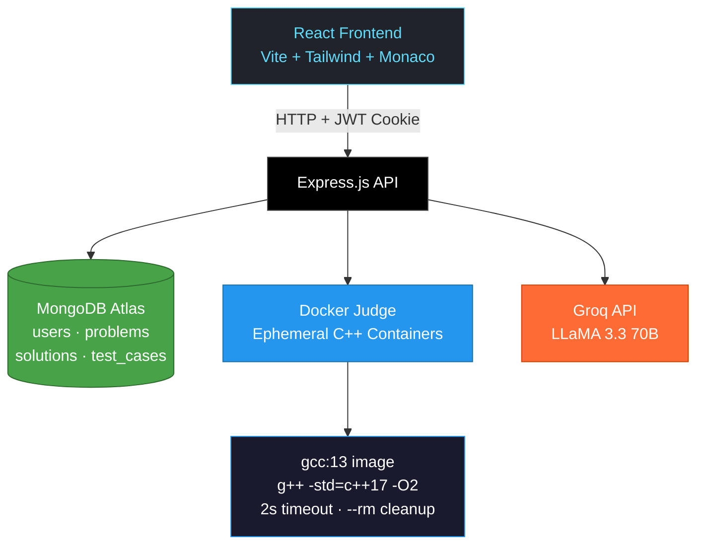
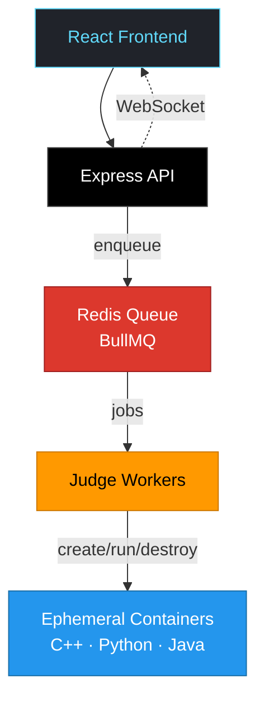
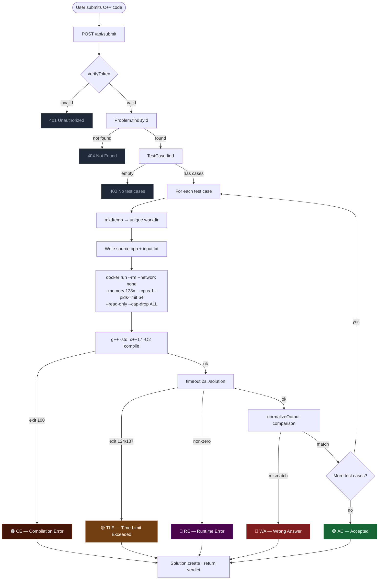
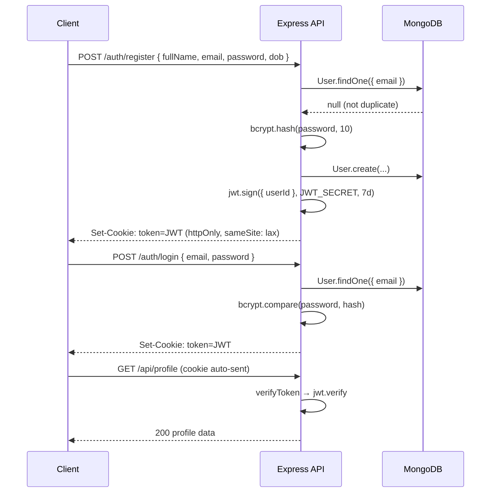
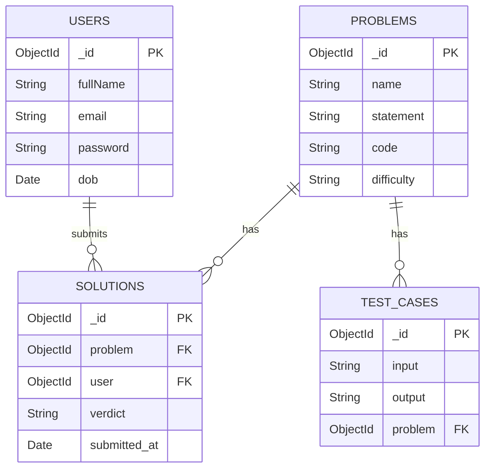

<div align="center">

# ⚖️ Online Judge

**A full-stack competitive programming platform built with the MERN stack.**  
Ephemeral Docker sandboxing · JWT authentication · AI-powered hints · Automated C++17 judging

<br/>


<br/>


</div>

---

## 📌 Overview

Online Judge is a production-grade competitive programming platform where users register, browse problems, submit C++ solutions, receive automated verdicts, and get **AI-powered hints** when they're stuck. The backend uses per-submission ephemeral Docker containers — every submission gets its own isolated workspace, network-disabled runtime, and automatic cleanup.

> 🤖 **What makes this different:** When you get a Wrong Answer or TLE, an AI assistant powered by **Groq + LLaMA 3.3** explains what went wrong in simple steps and lets you chat back and forth — without just giving you the answer.

---

## ✨ Features

| Area | Capability |
|---|---|
| 🔐 Authentication | Register, login, logout with bcrypt + JWT httpOnly cookies |
| 📋 Problems | Browse, search, and filter problems by difficulty |
| ⚡ Judging | C++17 compilation and execution in isolated ephemeral Docker containers |
| 🏆 Verdicts | `AC` `WA` `TLE` `RE` `CE` `SE` with color-coded display |
| 🤖 AI Hints | Groq-powered popup explains WA/TLE in simple steps |
| 💬 AI Chat | Follow-up conversation with AI assistant below the editor |
| 📊 Leaderboard | Ranked by accepted submissions with gold/silver/bronze top 3 |
| 👤 Profile | Submission history, verdict stats, acceptance rate |
| 🛡️ Security | httpOnly cookies, no-network Docker, CPU/memory/PID limits, read-only rootfs |

---

## 🤖 AI Assistant Flow

When a user gets **Wrong Answer** or **TLE**, this flow triggers:



---

## 🏗️ Architecture

### Current



### Production Target (Planned)



---

## 🔄 Submission Pipeline



---

## 🐳 Docker Isolation Model

### ❌ Old: Shared Persistent Container

```
Submission A ─┐
Submission B ─┼──► oj-gcc (shared forever) ── shared /tmp, shared process space
Submission C ─┘
```

### ✅ New: Per-Submission Ephemeral Containers

```
Submission A ──► Container A (uuid) ──► auto removed ✓
Submission B ──► Container B (uuid) ──► auto removed ✓
Submission C ──► Container C (uuid) ──► auto removed ✓
```

### Docker Runtime Controls

| Flag | Purpose |
|---|---|
| `--rm` | Auto-remove container after exit |
| `--network none` | No internet or service access |
| `--memory=128m` | Memory cap per submission |
| `--cpus=1` | CPU cap per submission |
| `--pids-limit=64` | Prevents fork bombs |
| `--read-only` | Immutable root filesystem |
| `--tmpfs /tmp` | Writable scratch space for compiler |
| `--security-opt no-new-privileges` | No privilege escalation |
| `--cap-drop ALL` | Drop all Linux capabilities |
| bind mount `/judge` only | Container sees only submission workspace |

---

## 🔐 Auth Flow



> **Why httpOnly cookies over localStorage?** `localStorage` is readable by any JS — XSS steals the token instantly. `httpOnly` cookies are invisible to JavaScript. Browsers send them automatically, attackers cannot read them.

---

## 🗃️ Database Schema



---

## 🔌 API Reference

> Base URL: `http://localhost:5000/api`  
> Protected endpoints require the `token` httpOnly cookie set by `/auth/login`.

| Method | Endpoint | Auth | Description |
|---|---|---|---|
| `POST` | `/auth/register` | No | Register new user |
| `POST` | `/auth/login` | No | Login, sets JWT cookie |
| `POST` | `/auth/logout` | No | Clears JWT cookie |
| `GET` | `/problems` | No | List all problems |
| `GET` | `/problems/:id` | No | Get problem by ID |
| `POST` | `/problems` | ✓ | Create problem |
| `PUT` | `/problems/:id` | ✓ | Update problem |
| `DELETE` | `/problems/:id` | ✓ | Delete problem |
| `POST` | `/testcases` | ✓ | Add test case |
| `GET` | `/testcases/:problemId` | No | Get test cases for problem |
| `DELETE` | `/testcases/:id` | ✓ | Delete test case |
| `POST` | `/submit` | ✓ | Submit code for judging |
| `POST` | `/ai/hint` | ✓ | Get AI hint for WA/TLE |
| `POST` | `/ai/chat` | ✓ | Continue AI conversation |
| `GET` | `/leaderboard` | No | Get leaderboard |
| `GET` | `/profile` | ✓ | Get user profile + stats |

---

## 📁 Repository Structure

```
Online-Judge/
├── client/                          # React + Vite frontend
│   └── src/
│       ├── pages/
│       │   ├── Home.jsx             # Problems table with search + filter
│       │   ├── Problem.jsx          # Split editor + AI chat panel
│       │   ├── Leaderboard.jsx      # Ranked table with medal colors
│       │   ├── Profile.jsx          # Stats cards + submission history
│       │   ├── Login.jsx
│       │   └── Register.jsx
│       └── components/
│           └── Navbar.jsx
├── docker/
│   └── Dockerfile.gcc               # GCC judge image definition
├── server/
│   ├── controllers/
│   │   ├── aiController.js          # Groq hint + chat handlers
│   │   ├── authController.js
│   │   ├── problemController.js
│   │   ├── submissionController.js
│   │   ├── leaderboardController.js
│   │   ├── testCaseController.js
│   │   └── profileController.js
│   ├── executors/
│   │   ├── docker/dockerCommand.js  # spawn wrapper for Docker CLI
│   │   ├── utils/output.js          # Output normalization
│   │   └── runCode.js               # Ephemeral container execution engine
│   ├── middleware/
│   │   └── auth.js                  # JWT verification middleware
│   ├── models/
│   │   ├── User.js
│   │   ├── Problem.js
│   │   ├── Solution.js
│   │   └── TestCase.js
│   ├── routes/
│   │   ├── ai.js                    # /api/ai/hint · /api/ai/chat
│   │   ├── auth.js
│   │   ├── problems.js
│   │   ├── submit.js
│   │   ├── leaderboard.js
│   │   ├── testCases.js
│   │   └── profile.js
│   └── index.js
├── .env.example
├── .gitignore
└── README.md
```

---

## ⚙️ Local Setup

### Prerequisites

- Node.js 18+
- npm
- Docker Desktop
- MongoDB Atlas account (free tier works)
- Groq API key — [get one free at console.groq.com](https://console.groq.com)

### 1. Clone

```bash
git clone https://github.com/Mikey3600/Online-Judge.git
cd Online-Judge
```

### 2. Configure environment

```bash
cd server
cp .env.example .env
```

Edit `.env`:

```env
MONGO_URI=mongodb+srv://<user>:<password>@cluster0.xxxxx.mongodb.net/onlinejudge
JWT_SECRET=your_long_random_secret_here
PORT=5000
CLIENT_ORIGIN=http://localhost:5173
JUDGE_DOCKER_IMAGE=gcc:13
JUDGE_DOCKER_TIMEOUT_MS=20000
GROQ_API_KEY=your_groq_api_key_here
```

### 3. Install and run backend

```bash
npm install
npm run dev
```

### 4. Pull judge image

```bash
docker pull gcc:13
```

### 5. Install and run frontend

```bash
cd ../client
npm install
npm run dev
```

Frontend at `http://localhost:5173` · API at `http://localhost:5000`

---

## 🛡️ Security

| Control | Implementation |
|---|---|
| Password hashing | bcrypt with salt rounds = 10 |
| Session token | JWT, expires in 7 days |
| Cookie transport | `httpOnly` + `sameSite: lax` |
| User enumeration prevention | Identical error for wrong email and wrong password |
| Route protection | `verifyToken` middleware on all protected routes |
| Network isolation | `--network none` per Docker container |
| Memory isolation | `--memory=128m` per container |
| CPU isolation | `--cpus=1` per container |
| Fork bomb prevention | `--pids-limit=64` |
| Privilege escalation | `--security-opt no-new-privileges` + `--cap-drop ALL` |
| Filesystem isolation | `--read-only` root + tmpfs for compiler scratch |

---

## ⚠️ Known Limitations

- C++17 only — no Python, Java, or other languages yet
- Submissions judged synchronously — no queue yet
- No admin role — any authenticated user can create/edit problems
- No hidden test cases or test case grouping

---

## 🚀 Future Scope

- **Redis + BullMQ** — async submission queue for production scale
- **WebSockets** — stream live verdict updates instead of polling
- **Contest Mode** — timed competitions with scoreboards and freeze windows
- **Rating System** — Codeforces-style rating progression
- **Multi-language** — Python, Java, JavaScript with per-language limits
- **Plagiarism Detection** — MOSS integration for similarity checks
- **Kubernetes** — horizontally scalable judge worker nodes

---

## 📚 References

- [Docker GCC Image](https://hub.docker.com/_/gcc)
- [Docker Security — Cap Drop](https://docs.docker.com/engine/reference/run/#runtime-privilege-and-linux-capabilities)
- [Groq API Docs](https://console.groq.com/docs)
- [isolate — IOI Sandbox](https://github.com/ioi/isolate)
- [BullMQ](https://docs.bullmq.io/)
- [Mongoose Docs](https://mongoosejs.com/docs/)

---

## 📄 License

MIT © [Mayank](https://github.com/Mikey3600)

---

<div align="center">
  <strong>Built by Mayank — CS Undergraduate, KIIT</strong><br/>
  <a href="https://github.com/Mikey3600">@Mikey3600</a>
</div>
